# AWS Lambda 收集自定义指标(Metrics)最佳实践  

## 前言  
AWS Lambda 是非常受欢迎的无服务器运行代码的云服务。我们知道 AWS Lambda运行所产生的日志(logs)会自动收集到 CloudWatch Logs 中，Lambda 所产生的通用运行指标(metrics) 例如：“调用数”、“持续时间”、“错误”、“并发数”等都会自动收集到 CloudWatch Metrics 中监控。而本文将阐述几种自定义指标的收集方法及其优缺点。

有一些场景是需要收集AWS Lambda运行产生的一些数据指标的，例如：用户访问行为相关的数据，某个函数分段的执行时长，某个实时参数等。这些指标与Lambda的运行本身无关，所以不像Lambda“调用数”、“持续时间”这些通用指标会自动反映到CloudWatch上。如果是有服务器(例如 Amazon EC2)的常见做法，可以记录到本地文件中，由一个独立 Agent 定时发送到 CloudWatch上，例如在 EC2 上安装 CloudWatch Agent去做收集。参见“使用 CloudWatch 代理从 Amazon EC2 实例和本地服务器收集指标和日志”。

而无服务器的 Lambda 虽然有一个本地临时目录(\tmp)可以写入文件，但 Lambda 运行环境是会被暂停或回收的，写本地文件并不可靠，可能会导致数据来不及发送就暂停或丢失了，那这些自定义的 Lambda 运行指标要怎么收集和监控呢？
  
## 预备知识  
  
1.	AWS Lambda 已与 CloudWatch Logs 集成，函数所产生的日志会自动收集到 CloudWatch Logs。输出和查看日志的方法参见 AWS Lambda 文档。不同的开发语言有相应的输出语句，例如以下 Python 语句都能生成日志： 
* print 语句  
* logging 模块中的 Logger 函数（例如，logging.Logger.info 和 logging.Logger.error）  
其他语言例如 Node.js 的 console.log()，Java 的 Log4j 2 或LambdaLogger.log()，Golang 的 log.Print() 都有类似的效果，自动输出日志到 CloudWatch Logs。

2.	如果是做故障定位和性能优化的，可以采用 AWS X-Ray 方便地跟踪 Lambda 函数运行   

3.	如果你发现需要对 Lambda 函数代码分段运行时间进行很多监控，并进行优化，则建议先重新考虑一下，是否你的 Lambda 函数设计得太大了。单个 Lambda 函数是否包含了过多的业务逻辑？如果是有多个步骤组成的，可以考虑改为多个 Lambda 函数，并使用 AWS Step Function 工作流进行协同。

## Lambda 自定义指标的收集和监控
以下列举三种收集Lambda 自定义指标的方法，分别是  
* 直接发送 CloudWatch PutMetricData API 接口收集
* 利用 CloudWatch 日志过滤收集
* 利用 CloudWatch 日志触发 Lambda 来处理和提交 CloudWatch 接口

### 方法一：直接调用 CloudWatch PutMetricData API

CloudWatch 提供了 PutMetricData API，可以在函数代码中直接调用该 API 把指标数据提交到 CloudWatch。
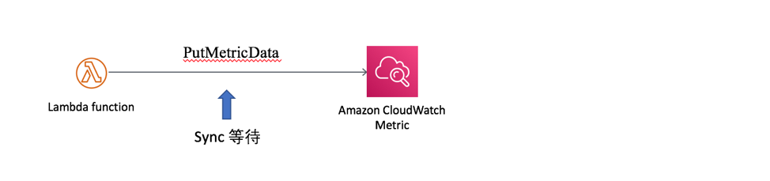
优点：Lambda 函数运行的时候同步请求发送数据，指标最小粒度达到1秒。  
缺点：同步方式，增加了函数的运行时间。您将在后面的实验结果中看到，例子中每次发送 PutMetricData 的时间约50ms。时延依赖于 CloudWatch API 的响应速度，如果 CloudWatch API 有异常则直接对主业务逻辑造成影响。  
另外要注意，默认的软限制是 PutMetricData 150 transactions per second (TPS)，可申请提升。  
实现方式，例如以下 Python 编写的 Lambda 示例：
```
import boto3
CWclient = boto3.client('cloudwatch')

def lambda_handler(event, context):
    CWclient.put_metric_data(
        Namespace='LambdaCustomMetrics',
        MetricData=[
            {
                'MetricName': 'myPutCustomMetric',
                'Value': value,
                'StorageResolution': 1
            },
        ]
    )
    return
```
注意：Lambda 的运行角色需要有 cloudwatch:PutMetricData 执行权限

### 方法二：通过 CloudWatch Logs Filter 传递指标
如前所述，Lambda 已经集成了 CloudWatch Logs，可以在函数中把需要传递的指标写入日志，并在 CloudWatch Logs 中设置过滤器(Filter)来提取指标。
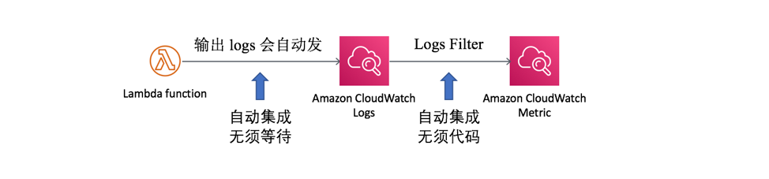
优点：异步方式，避免了对函数运行时间的影响。Lambda 写 Log 是后台自动完成无需考虑架构。  
缺点：统计结果只精确到分钟。且需要配置管理 Logs Filter。CloudWatch Logs Filter 每个日志组只能设置100个，硬限制，不适合一个 Lambda 有大量个性化指标和粒度为秒的情况。

实现方式，例如以下 Lambda 的 Python 语句将写入日志：
```
print('my_metric_in_log myCustomMetric', str(value))
```
然后，在 CloudWatch Logs 控制面板对应 Lambda 的日志组(Log Group)中设置Filter
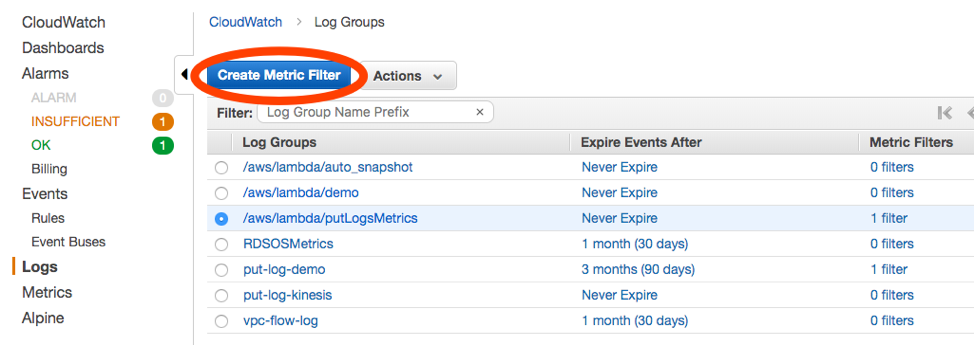
设置过滤模版(Filter Pattern)，本例中写入的日志是“my_metric_in_log 名字 数值”，所以模版配置成“[p=my_metric_in_log, name, value]”。您可以点击”Test Pattern”测试现有日志的匹配结果。
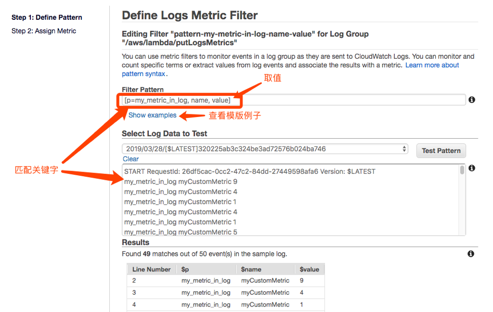
匹配到关键字 my_metric_in_log 的日志，就会取出值到 value 变量。在下一步中，配置 Metric 值为 $value 变量即可实现从日志中提取指标。考虑到避免空数据的情况，可选设置默认值为0。
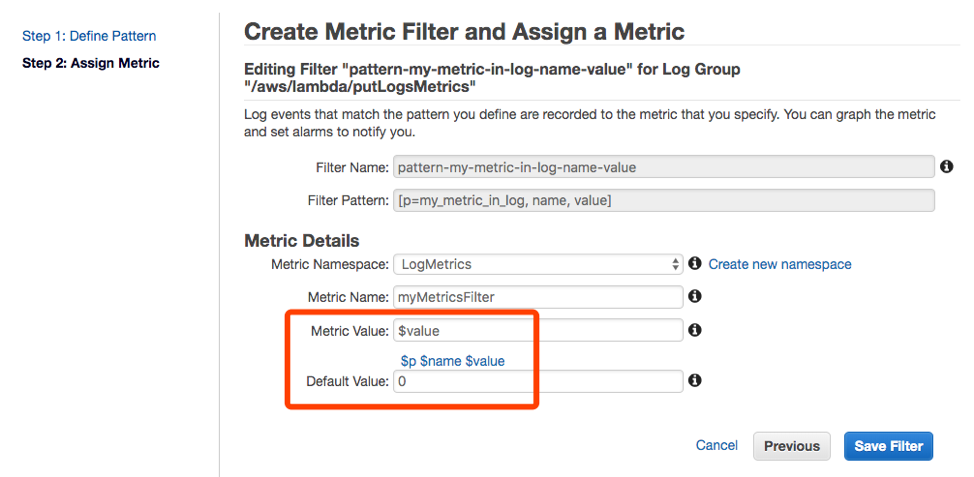
保存了 Filter 的配置后，可以点击您设置的指标名称跳转到对应的监控指标界面。或者点击 Create Alarm 配置告警阀值，并实现联动，例如发送 SNS 通知或者触发 Lambda 做自动化处理。
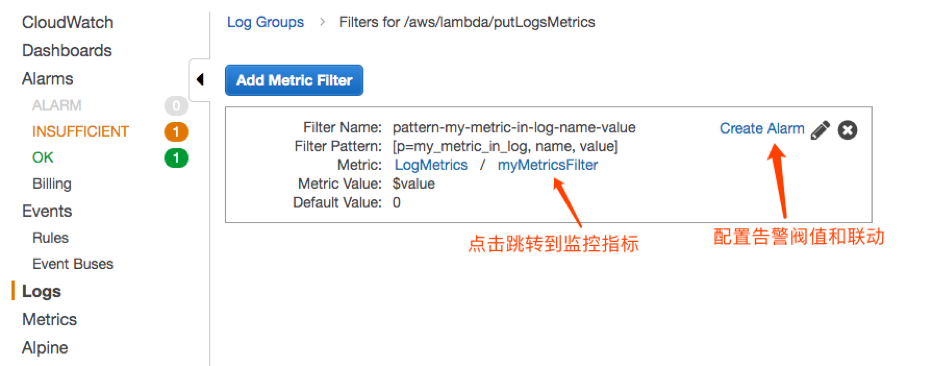

### 方法一、二的示例和实验结果对比
我们用一个 Lambda 函数同时做方法一和方法二，我们来对比一下。代码示例如下：

本例中，我们随机生成一个 value 作为要发送的指标数据，每个数据是随机的1-20整数。每次发送指标到 CloudWatch PutMetricData API 接口的间隔为1秒，并同时写入日志。让 Lambda 运行600秒，即我们应该收到600次发送指标数据。最后返回统计平均每次 PutMetricData 的时间。
```
import boto3
import time
import datetime
import random
CWclient = boto3.client('cloudwatch')

def lambda_handler(event, context):
    total_detal = 0
    for i in range(0, 600):
        # caculate put metric time
        start = datetime.datetime.now()

        # put custom metric
        value = random.randint(1, 20)
        CWclient.put_metric_data(
            Namespace='LambdaCustomMetrics',
            MetricData=[
                {
                    'MetricName': 'myPutCustomMetric',
                    'Value': value,
                    'StorageResolution': 1
                },
            ]
        )
        end = datetime.datetime.now()
        delta = ((end - start).microseconds) / 1000
        total_detal += delta
        time.sleep(0.95)
        print('my_metric_in_log myCustomMetric', str(value))
    return 'avg_detal: '+str(total_detal/600)


```
当我们用 CloudWatch 同时打开 PutMetricData 获得的指标（下图左侧单位，蓝色曲线）和通过 Log Filter 获得的指标（下图右侧单位，橙色曲线）。
* 统计周期一分钟
选择统计方式为“求和”(Sum)，统计周期为1分钟。我们会看到两种方式的曲线非常重合，时延和数值的差异并不大，结果如下图：
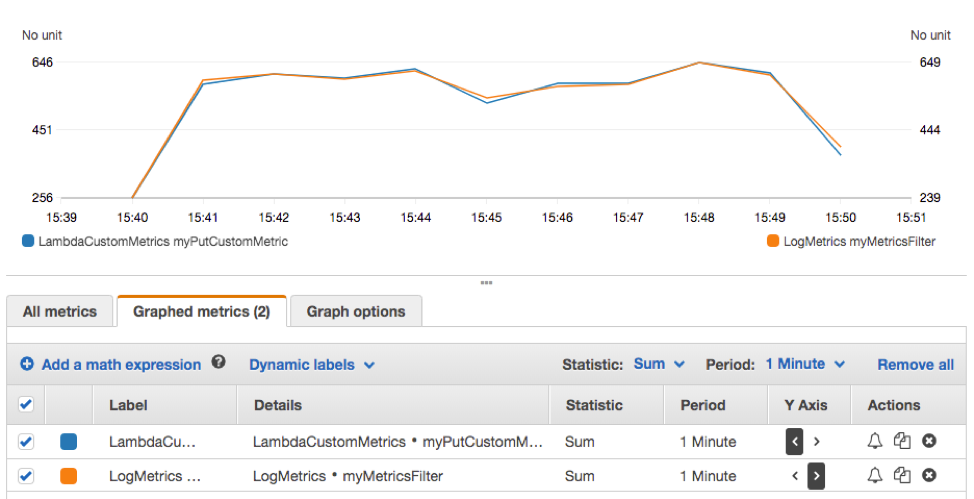
把统计方式改为“采样数量”(Sample Count)，统计周期依然是1分钟。两种方式也是一致的，每分钟都收到了60次数据。
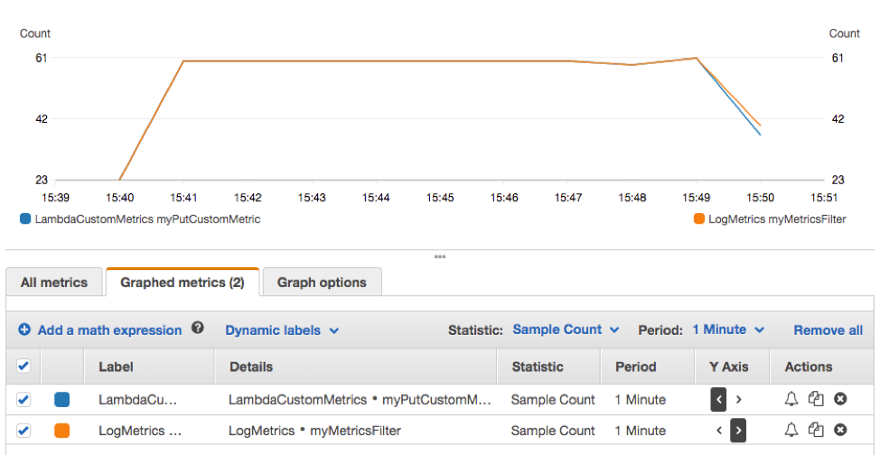
统计方式改为“平均值”(Average)，两种方式结果相近。
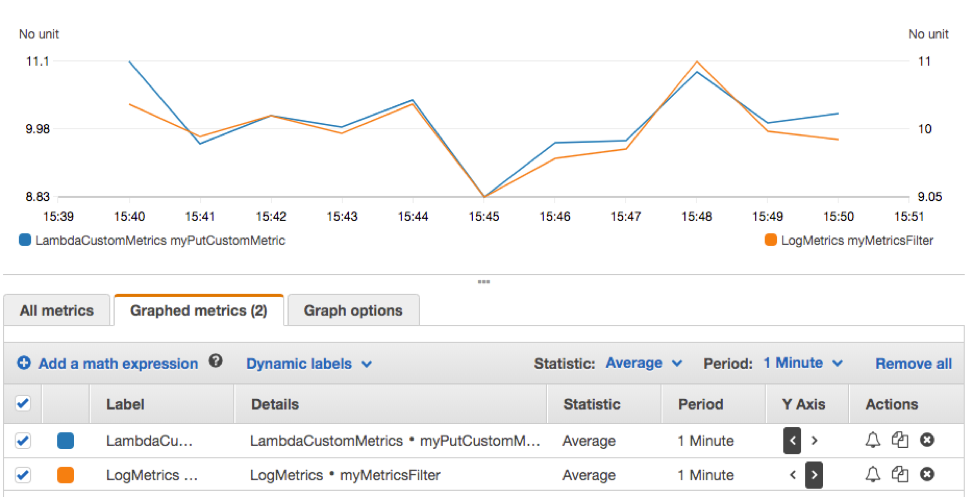
* 统计周期1秒
如果把统计周期改为1秒，我们再看“求和” Sum、“采样数量” Sample Count 和“平均值” Average 的结果。采用 PutMetricData 收集的数据可以达到秒级的粒度，而采用 Logs Filter 的方式则不能。
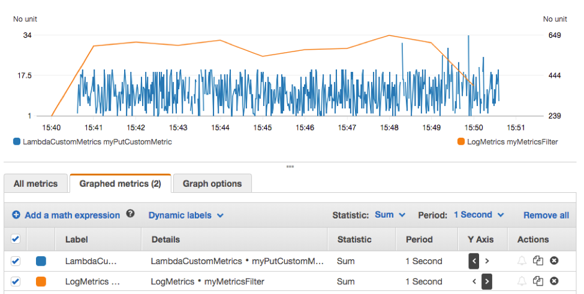
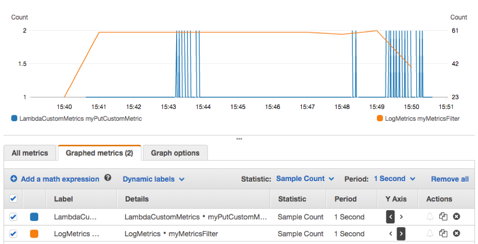
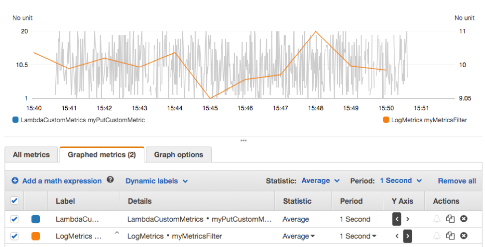
我们再看看 PutMetricData 所消耗的时间，在本次测试的这10分钟内，每次请求的平均时间接近50ms。
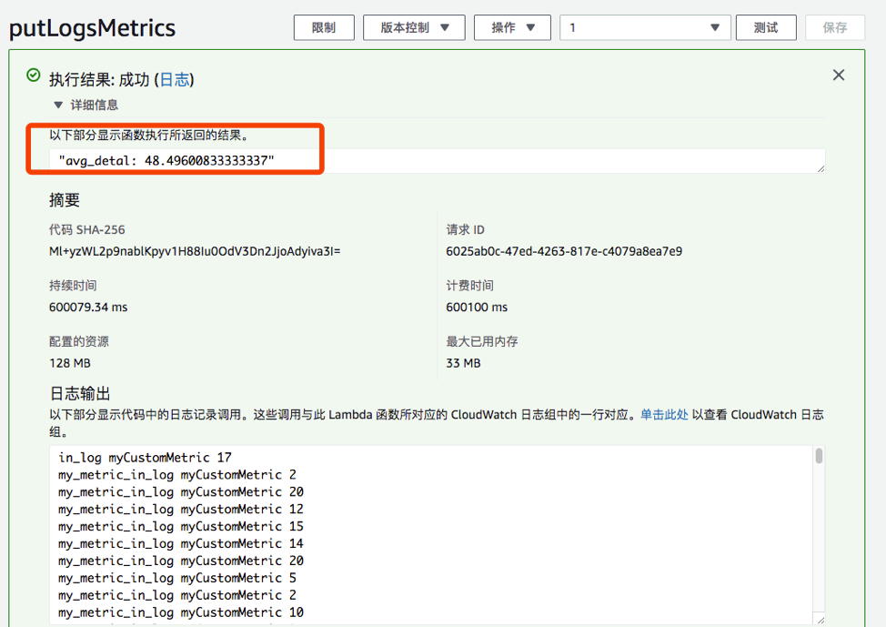

### 方法三：CloudWatch Logs触发Lambda做指标提取并提交
即把方法一中的主 Lambda 函数中的 PutMetricData 操作剥离成一个独立的提取指标的 Lambda，主 Lambda 像方法二那样把指标写入 Logs，然后配置 CloudWatch Logs 触发提取指标的 Lambda 从 Logs 中提取并提交 CloudWatch 指标收集
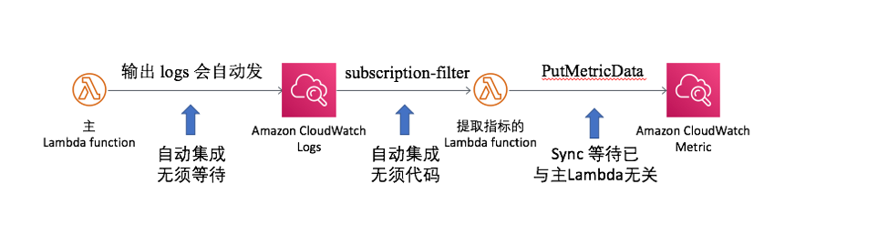
优点：主函数逻辑和提交指标异步解耦，互相不影响。CloudWatch Logs触发Lambda是异步触发，出错会自动重试2次。统计精度达到秒级。不受每个Logs Group 的Filter 100个数量的限制，完全自定义，非常灵活。  
缺点：架构变复杂了。Lambda的并发多了一倍。  

实现方式，新建一个从 Logs 中提取指标的 Lambda，配置这个 Lambda 由CloudWatch Logs 触发，选择主 Lambda 函数的日志组，配置筛选模式(Filter Pattern)跟前面方式二在 CloudWatch Logs 中配置 Filter Pattern 一样的方式。如下图：
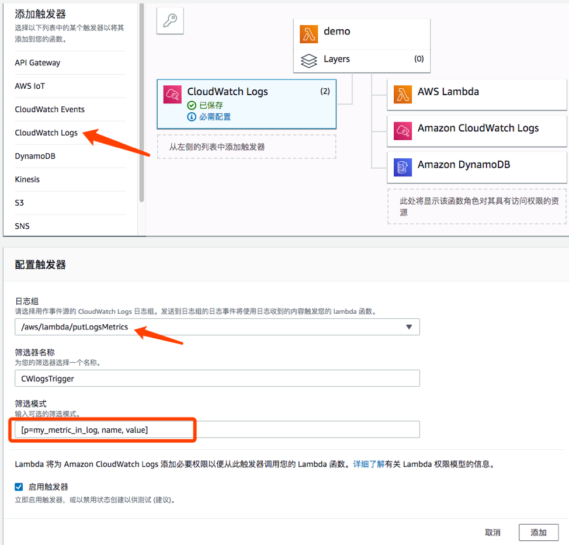
编写处理日志的 Lambda 函数。注意 CloudWatch Logs 触发 Lambda 所提交的event 是经 base64 编码且是压缩的，需解压处理，示例代码如下：
```
import json
import gzip
import base64
import boto3
CWclient = boto3.client('cloudwatch')

def lambda_handler(event, context):
    # TODO implement
    payload = gzip.decompress(base64.b64decode(event['awslogs']['data']))
    value_list = json.loads(payload)['logEvents']
    for i in value_list:
        try:
            value = int(i['extractedFields']['value'])

            # put custom metric
            CWclient.put_metric_data(
                Namespace='LambdaCustomMetrics',
                MetricData=[
                    {
                        'MetricName': 'SecondLambdaPutMetric',
                        'Value': value,
                        'StorageResolution': 1
                    },
                ]
            )
        except Exception as e:
            print(e)
    return
```
匹配了 Filter Pattern 所输出的 logEvnets 示例如下：
```
{
    "messageType": "DATA_MESSAGE",
    "owner": "31340000000",
    "logGroup": "/aws/lambda/putLogsMetrics",
    "logStream": "2019/03/29/[$LATEST]a4e25d49479441439bf06f41dfeb339c",
    "subscriptionFilters": [
        "Lambda_custom_metric_proccess_filter"
    ],
    "logEvents": [
        {
            "id": "34651910332582237088994078865747388003785804733060153344",
            "timestamp": 1553845399519,
            "message": "my_metric_in_log myCustomMetric 15\\n",
            "extractedFields": {
                "p": "my_metric_in_log",
                "name": "myCustomMetric",
                "value": "15"
            }
        }
    ]
}
```
留意这里有个“extractedFields”属性，就是填了筛选模式(Filter Pattern)后系统从 message 中匹配出来的，如果不填 Pattern ，则没有“extractedFields”属性，只有前面那个“message”属性。  
然后提交 PutMetricData 到 CloudWatch 操作同方法一，此处不再赘述。  

由于本例的 Lambda 是每秒发一次数据，所以我们这里用统计的每秒“平均值”展示结果：
左边单位蓝色曲线的是主 Lambda 函数直接 PutMetricData，右边单位橙色曲线的是经过 Log 触发后的 Lambda PutMetricData。数据基本一致，曲线显示延迟了2秒左右。  
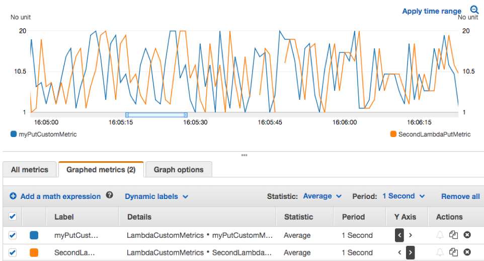

### 方法三延伸1:
当然，如果有多个 Lambda 应用，可以共用一个专门的转发指标的 Lambda。如下图：
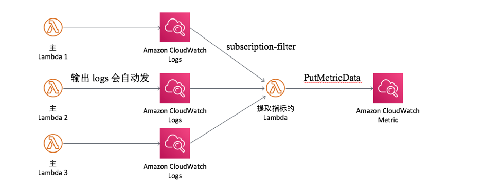
### 方法三延伸2:
要注意，默认的软限制是 PutMetricData 150 transactions per second (TPS)，可申请提升。如果并发较高的，建议用 Kinesis 收集汇聚，然后再发送CloudWatch Metric 或发送其他指标监控平台。

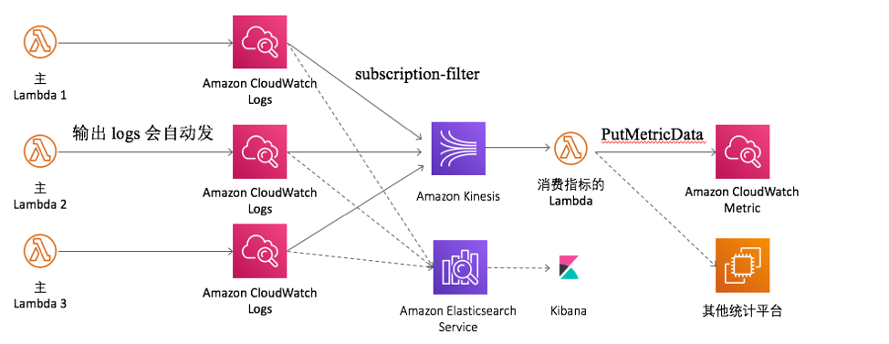

## 参考文档
使用 CloudWatch 代理从 Amazon EC2 实例和本地服务器收集指标和日志  
https://docs.aws.amazon.com/zh_cn/AmazonCloudWatch/latest/monitoring/Install-CloudWatch-Agent.html 

AWS Lambda文档  
https://docs.aws.amazon.com/zh_cn/lambda/latest/dg/welcome.html

Amazon CloudWatch发布自定义指标” 文档”  
https://docs.aws.amazon.com/zh_cn/AmazonCloudWatch/latest/monitoring/publishingMetrics.html

AWS Python SDK文档  
https://boto3.amazonaws.com/v1/documentation/api/latest/reference/services/cloudwatch.html#CloudWatch.Client.put_metric_data

AWS X-Ray文档  
https://docs.aws.amazon.com/zh_cn/lambda/latest/dg/lambda-x-ray.html

