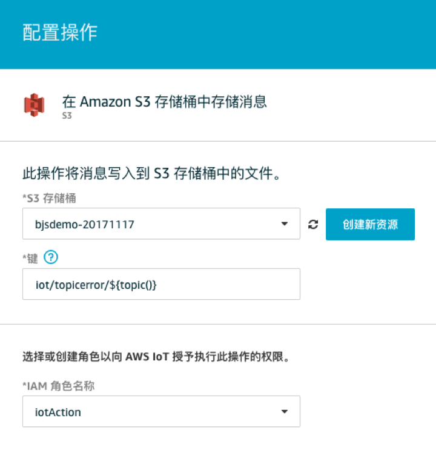

# 大批量IoT设备分级分权管理方案

大批量的IoT设备，而且有各种类型，分布在各个现场的情况下，通常是需要分级别，分类型来进行权限控制，并要能根据级别和设备类型进行批量订阅。以下方案说明其实现原理

## 分级分类型的权限管理
IoT设备名称ThingName规则为：小区号-楼号-类型-序列号，用”-“号分割。
注：AWS IoT Thing Name不能用正斜杠”/”分割
例如：
“0001-abcd-typeA-sn123456789012345678901234567890”

在配置管理权限的策略时，例如IAM User的策略，可以采用分级别，或分类型通配的规则，例如以下Policy：
  
    {
        "Version": "2012-10-17",
        "Statement": [
            {
                "Sid": "VisualEditor0",
                "Effect": "Allow",
                "Action": "iot:GetThingShadow",
                "Resource": [
                    "arn:aws-cn:iot:cn-north-1:313497334385:thing/????-????-typeB-*",
                    "arn:aws-cn:iot:cn-north-1:313497334385:thing/0001-????-typeA-*"
                ]
            }
        ]
    }

其中，  
第一条resource ARN是允许获得所有typeB的影子数据  
第二条resource ARN是允许获得0001小区的所有typeA的影子数据  

您可将通配符作为资源 ARN 的一部分。可在任何 ARN 分段(用冒号分隔的部分) 中使用通配符 (* 和 ?)。星号 (*) 表示字符的任意组合，问号 (?) 表示任何单个字符。可在每个分段中使用多个 * 或 ? 字符，但通配符不能跨分段。
ARN通配方式说明参考：  
https://docs.aws.amazon.com/zh_cn/IAM/latest/UserGuide/reference_policies_elements_resource.html  

## 批量订阅方法

需求：IoT监控大屏应用，希望能一个订阅就能收到一批指定Thing的影子更新消息，例如某小区全部TypeA的设备。Thing的命名规则同第1小节，为：小区号-楼号-类型-序列号，用”-“号分割。例如：  
“0001-abcd-typeA-sn123456789012345678901234567890”  
如何实现一个订阅操作，即可完成某小区全部TypeA的设备的订阅，或者影子更新信息呢？  
  
难点：因为IoT进行订阅时，只能通配以”/”间隔的Topic，通配符是”+”和”#”，无法从ThingName中直接提取出以”-”分割的设备级别和类型字段
所以以下采用Republish Topic的方式，并利用函数替换ThingName的”-”为Topic的”/”

### 方法：  
1、创建一个rule，所有影子的更新消息，都重新Republish 到ThingName对应的Topic，同时转换为”/”分割，即  
0001-abcd-typeA-sn123456789012345678901234567890  
转换为  
0001/abcd/typeA/sn123456789012345678901234567890  

提示：AWS IoT Topic是不需要创建的，直接发布即可  

技巧：转换ThingName为Topic时这个用到函数  
  
        ${regexp_replace(topic(3), "-", "/")}

* 详细说明：  
a) 新建Rule  

属性为消息中的JSON，因为影子消息的最外层是state，第2层是  reported，所以摘取这个部分  
主题筛选条件为$aws/things/+/shadow/update/accepted，其中的“+”号是匹配了所有的ThingName  
保存该配置  

b) 配置“添加操作”

操作为重发布到IoT主题  
主题 `${regexp_replace(topic(3), "-", "/")} `   
函数说明如下  
topic(3)函数是提取Topic的第3段，topic是
$aws/things/+/shadow/update/accepted  
每段以"/"间隔，第3段即ThingName  
regexp_replace()函数是替换 "-"为 "/"  

IoT函数参考：
https://docs.aws.amazon.com/zh_cn/iot/latest/developerguide/iot-sql-functions.html?shortFooter=true#iot-func-regex-replace

c) 配置角色Role规则如下：
  
    {
        "Version": "2012-10-17",
        "Statement": {
            "Effect": "Allow",
            "Action": [
                "iot:Publish",
                "s3:PutObject"
            ],
            "Resource": "*"
        }
    }
或者为了简便，可以在测试阶段用这个通用的策略：  

  
保存以上“操作”配置  
  
（Option）配置收集错误消息的规则，放到S3桶

最终配置结果界面如下：  

  
2、监控大屏应用只需要订阅Topic通配，即可监控一批指定的Thing
例如以上规则，订阅以下几个Topic任意一个，当影子更新时都可以收到消息   

*	0001/abcd/typeA/sn123456789012345678901234567890
*	0001/abcd/+/+
*	0001/+/typeA/+
*	+/+/typeA/+
  
而订阅这个Topic则收不到
*	+/+/typeB/+  
因为typeB不匹配。

## 主题通配符
消息代理使用主题将消息从发布客户端路由到订阅客户端。正斜杠 (/) 用于分隔主题层次结构。下表列出了订阅时可在主题筛选条件中使用的通配符。  
通配符	描述  
`#	必须是您要订阅的主题中的最后一个字符。通过将当前树与所有子树相匹配来发挥通配符的作用。例如，Sensor/# 订阅将接收发布到 Sensor/、Sensor/temp 和 Sensor/temp/room1 的消息，但不会接收发布到 Sensor 的消息。`  
`+	精确匹配主题层次结构中的一个项目。例如，Sensor/+/room1 订阅将接收发布到 Sensor/temp/room1、Sensor/moisture/room1 等的消息。`  
参考IoT主题的说明：
https://docs.aws.amazon.com/zh_cn/iot/latest/developerguide/topics.html

## AWS IoT限制
设计时要注意以下限制：  
* 消息大小: 每个发布请求的负载限制为 128 KB。AWS IoT 服务会拒绝超过此大小的发布和连接请求。  
* 客户端 ID 大小:	128 字节（UTF-8 编码的字符）。  
* 主题大小: 发送发布请求时向 AWS IoT 传递的主题不能超过 256 字节 UTF-8 编码字符。  
* 主题和主题筛选条件中斜杠的最大数量: 发布或订阅请求中的主题限于 7 个正斜杠 (/)。  

AWS IoT Rules Engine 限制  
* 每个 AWS 账户的规则的最大数量:	1000
* 每个规则的操作数量:	每个规则最多可定义 10 项操作。
* 规则大小:	最多 256 KB（UTF-8 编码的字符，包括空格）。

