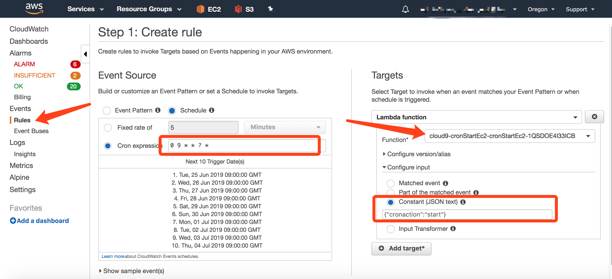
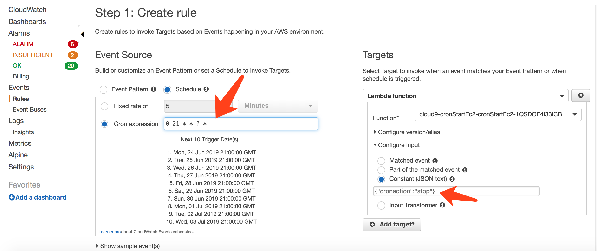
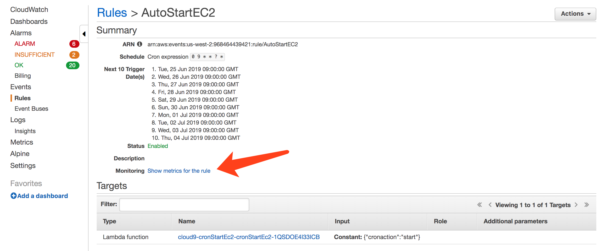

# 定时任务每天自动开关 EC2   
## 说明
本教程使你可以批量设置 EC2 定时启动和关闭，并可以通过设置 EC2 的标签 Tag 来决定该 EC2 是否纳入批量启动和关闭的范围内。  
在本范例中，以 autostart 作为标签的 Tag Key，至于值 Tag Value 则可以随便设置。即只要 EC2 加一个 Key 为 autostart 的 Tag，不管 Value 设置什么，都会参与到自动启动和关闭的任务中。  
  
## 步骤

1. 创建 IAM Role   
  创建一个 IAM Role，赋予 Lambda 具有操作 EC2 Start 和 Stop 权限。并且有最基本的写 log 权限。策略示例如下：  
```
{
    "Version": "2012-10-17",
    "Statement": [
        {
            "Sid": "VisualEditor0",
            "Effect": "Allow",
            "Action": [
                "logs:CreateLogStream",
                "ec2:DescribeInstances",
                "ec2:StartInstances",
                "ec2:StopInstances",
                "logs:CreateLogGroup",
                "logs:PutLogEvents"
            ],
            "Resource": "*"
        }
    ]
}
```

2. 用附件的 cron-lambda.py 创建一个 Lambda 函数  
* 开发语言选择 Python3.6 

* 执行角色选择前一步骤新建的角色

* Lambda 超时时间，取决于要执行快照的实例多少，建议设置长一点，最大可设置15分钟

* Lambda执行内存，实例数量不多的（100个以内），可以取默认的128MB

* 粘贴 python 代码，并保存  
  
* Optional: 对于生产环境，建议对Lambda中的执行失败发送通知，请增加SNS发送权限  

3. 创建 CloudWatch Event 定时任务启动 EC2 的规则  
  CloudWatch 控制台，新建 Event Rules 。  


* 设置定时任务执行时间，Cron表达式的写法可以[参考文档](https://docs.amazonaws.cn/AmazonCloudWatch/latest/events/ScheduledEvents.html#CronExpressions)。上图例子设置的是每天早上9点启动。  
* 选择执行的 Lambda，即刚才创建的 Lambda 函数
* 设置 Lambda 触发的参数。这里用来指定是个启动 EC2 任务，还是停止 EC2 任务。
```
{"cronaction":"start"}
```
4. 再次创建 CloudWatch Event 定时任务停止 EC2 的规则  
  CloudWatch 控制台，新建 Event Rules 。上图例子设置的是每天晚上21点关闭。  

* 选择执行的 Lambda，即刚才创建的 Lambda 函数
* 设置 Lambda 触发的参数。这里用来指定是停止 EC2 任务。
```
{"cronaction":"stop"}
```
5. 为 EC2 服务器增加一个标签  
以 autostart 作为标签的 Tag Key，至于值 Tag Value 则可以随便设置。即只要 EC2 加一个 Key 为 autostart 的 Tag，不管 Value 设置什么，都会参与到自动启动和关闭的任务中。  

6. 监控 Rule 执行
在 CloudWatch Event Rule 里面，选择对应的 Rule，点 Monitor (Show metrics for the rule) 就可以看到 Rule 被定时触发的情况  
