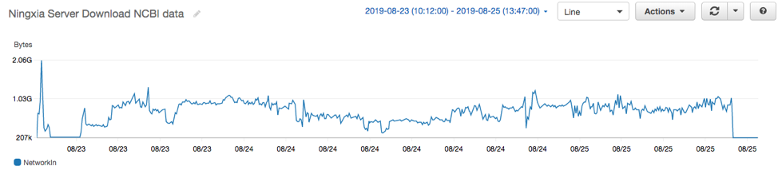
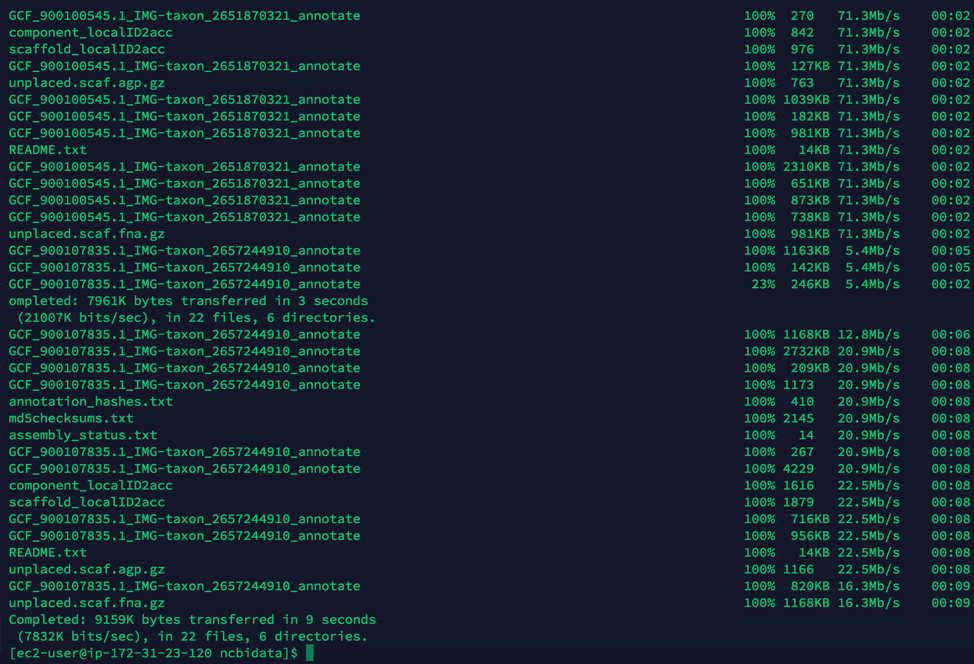
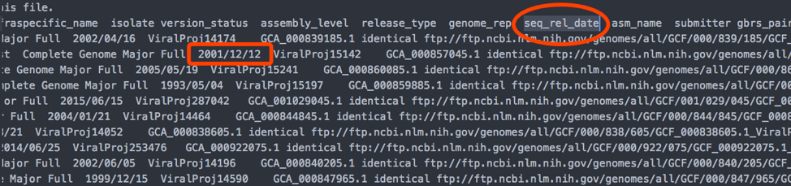

# 自动下载 NCBI 公开数据集  
## NCBI 下载说明  
* NCBI 的网址提供了 ftp server 只支持FTP. 索引文件：  
ftp://ftp.ncbi.nlm.nih.gov/genomes/refseq/archaea/assembly_summary.txt  
ftp://ftp.ncbi.nlm.nih.gov/genomes/refseq/fungi/assembly_summary.txt  
ftp://ftp.ncbi.nlm.nih.gov/genomes/refseq/bacteria/assembly_summary.txt  
ftp://ftp.ncbi.nlm.nih.gov/genomes/refseq/viral/assembly_summary.txt  
这四个文件总共有 165460 行，每一行是需要发起一次FTP下载，下载路径在文件的第 20 列”ftp_path”相应的内容。  
* 下载建议使用 aspera:  
wget https://download.asperasoft.com/download/sw/connect/3.9.6/ibm-aspera-connect-3.9.6.173386-linux-g2.12-64.tar.gz  
* 下载命令举例:   
ascp -i /home/ec2-user/.aspera/connect/etc/asperaweb_id_dsa.openssh -T -k1 -l500M anonftp@ftp.ncbi.nlm.nih.gov:genomes/all/GCF/000/010/525/GCF_000010525.1_ASM1052v1 ./  
## 工具说明  
* 把 ncbi-download.py 拷贝到跟索引的txt文件同一目录下
* 运行  python ncbi-download.py  会自动搜索当前目录下所有txt文件，并对逐个文件里面的ftp路径逐行下载，对于‘#’备注的行会跳过。下载的文件会放在以索引txt文件的文件名为目录名的路径下面。  
* ncbi-count.py 是统计当前目录下面所有ncbi数据记录个数，重复的项目名字会只记一次，下载完文件，运行这个统计工具就可以跟原始的txt对比就知道是否完全下载。

## 下载测试速度记录
* 在AWS中国宁夏的服务器下载：  
共约50小时，内容共1.4TB，通过脚本（ncbi-count.py）统计了下载的记录数 为165366，与原txt索引文件的记录数要求的165460基本一致  
```
('assembly_summary_fungi', ' count: ', 289)
('assembly_summary_archaea', ' count: ', 897)
('assembly_summary_viral', ' count: ', 9329)
('assembly_summary_bacteria', ' count: ', 154851)
('Total: ', 165366)
```
下载是通过Python调用了10个线程，每个线程调用ascp同时进行下载（见ncbi-download.py），以下截图是下载全过程服务器的网口入流量：  

速度因为时快时慢，取决于NCBI源端和网络的速度，以下截屏是某一时刻的，仅供参考  

* 在 AWS 美国俄勒冈服务器下载做比较：  
共约 29个小时，时间缩短一半，下载的记录数 165416，与宁夏下载的以及要求的原txt索引文件的记录数接近。考虑到在美国服务器下载后，还要推送到中国区，AWS中国区访问NCBI已经足够快了，绕美国服务器时间就没有节省多少了。  
本次测试所用服务器只使用了 t3.small 这样的小型 EC2，挂载了 HDD 磁盘  
* 其他观察：  
发现每条记录都有一个seq_rel_date，是不是以后可以通过这个日期来判断，只需要增量下载更新，不需要每次都全量下载。这样只需要隔几天跑一个自动的定时任务下载txt索引文件进行比对触发自动下载即可。  

