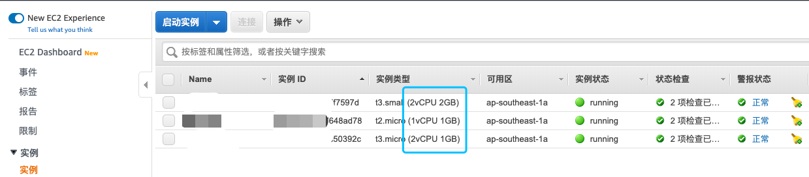
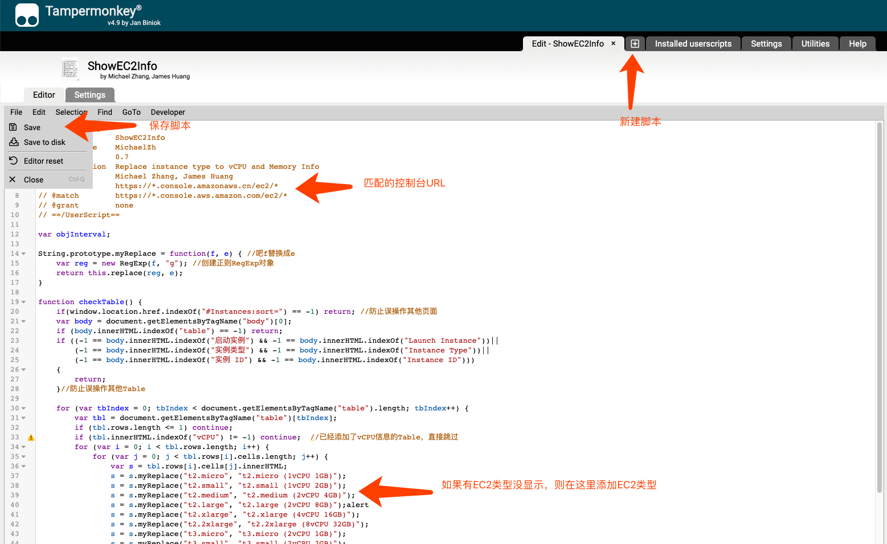

# 在 AWS 控制台，EC2 列表中显示CPU和内存配置

AWS 控制台，EC2 列表中实例类型并不显示每种实例对应的 CPU 和内存大小，要去一一查找有时不那么方便。以下采用浏览器 Tampermonkey 插件自己写脚本即可实现自动显示实例类型的 CPU 和内存配置。支持 AWS Global 和 China 区，支持中英文界面。  

插件网址:
https://www.tampermonkey.net/

支持浏览器:
* Chrome
* Microsoft Edge
* Safari
* Firefox
* Opera Next
* Dolpyin Browser
* UC Broswer

脚本:
ShowEC2Info.js

说明：如果你需要的EC2类型没有包含进去，可以自行在脚本中补充，记得保存 File->Save。配置后的效果如图

在此基础上，你还可以增加内容，例如拆开每个region都独立匹配一个脚本，然后把每小时价格添上。

Provided by Michael Zhang, James Huang